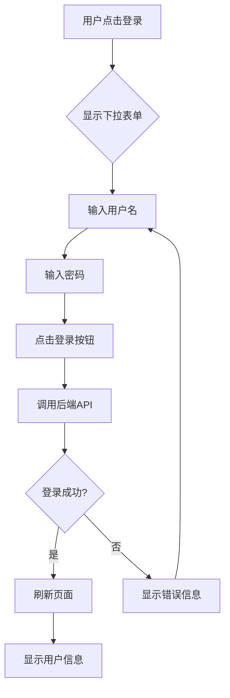

# 🎉 登录下拉框功能完成！

## ✅ **已实现功能**

### **核心功能**

1. ✅ **点击"登录"按钮**
2. ✅ **显示下拉登录表单**
3. ✅ **输入用户名和密码**
4. ✅ **直接在下拉框中登录**
5. ✅ **登录成功后自动刷新页面**
6. ✅ **显示用户头像和用户名**

---

## 🎯 **使用方法**

### **步骤 1：访问编辑器**

打开浏览器，访问：
```
http://localhost:8081/classroom/scratch/editor
```

---

### **步骤 2：点击"登录"按钮**

在 **Scratch 编辑器的绿色顶部菜单栏**，**最右侧**，点击 **"登录"** 按钮。

---

### **步骤 3：填写登录信息**

下拉框会弹出，显示登录表单：

```
┌──────────────────────────────┐
│  Sign in to MetaSeekOJ       │
│                              │
│  Username                    │
│  [________________]          │
│                              │
│  Password                    │
│  [________________]          │
│                              │
│  [    Sign in    ]           │
└──────────────────────────────┘
```

输入：
- **用户名**：`root`
- **密码**：`lgx780504`

---

### **步骤 4：点击登录**

点击 **"Sign in"** 按钮。

如果登录成功：
- ✅ 页面自动刷新
- ✅ 右上角显示用户头像和用户名：`[👤 柳老师 ▼]`
- ✅ 可以开始使用编辑器

如果登录失败：
- ❌ 显示错误信息（红色提示框）
- 🔄 可以重新输入

---

## 🎨 **界面预览**

### **未登录时**

```
┌──────────────────────────────────────────────────┐
│ [Logo] 文件 编辑 ...           [加入Scratch] [登录] │
└──────────────────────────────────────────────────┘
                                                ↑
                                        点击这里登录
```

---

### **点击登录后**

```
┌──────────────────────────────────────────────────┐
│ [Logo] 文件 编辑 ...           [加入Scratch] [登录▲]│
│                                 ┌──────────────┐  │
│                                 │ 登录表单     │  │
│                                 │ Username:    │  │
│                                 │ [_________]  │  │
│                                 │ Password:    │  │
│                                 │ [_________]  │  │
│                                 │ [登录]       │  │
│                                 └──────────────┘  │
└──────────────────────────────────────────────────┘
```

---

### **登录成功后**

```
┌──────────────────────────────────────────────────┐
│ [Logo] 文件 编辑 ...           [📁] [👤 柳老师 ▼]   │
└──────────────────────────────────────────────────┘
                                            ↑
                                    显示用户信息

点击用户名下拉：
┌──────────────┐
│ 我的作品     │
│ 账户设置     │
│ ──────────   │
│ 退出登录     │
└──────────────┘
```

---

## 🔧 **技术实现**

### **修改的文件**

1. **`login-dropdown.jsx`** - 登录下拉组件
   - 添加了完整的登录表单
   - 实现了用户名/密码输入
   - 调用后端登录 API
   - 处理登录成功/失败

2. **`login-dropdown.css`** - 登录下拉样式
   - 美化了登录表单
   - 添加了输入框样式
   - 添加了错误提示样式
   - 添加了按钮样式

---

### **登录流程**



---

### **API 调用**

**端点**：`POST http://localhost:8086/api/login/`

**请求体**：
```json
{
  "username": "root",
  "password": "lgx780504"
}
```

**成功响应**：
```json
{
  "error": null,
  "data": "Succeeded"
}
```

**失败响应**：
```json
{
  "error": "error_message",
  "data": "Invalid credentials"
}
```

---

## ⚠️ **注意事项**

### **1. 登录后页面会刷新**

登录成功后，页面会自动刷新（`window.location.reload()`）以更新用户状态。

**原因**：
- 需要重新获取用户信息
- 更新 Scratch 编辑器的登录状态
- 显示用户头像和用户名

---

### **2. Session Cookie 认证**

登录使用的是 Django 的 Session Cookie 认证：
- ✅ 登录后 Cookie 自动保存
- ✅ 后续请求自动携带 Cookie
- ✅ 支持跨域请求（`credentials: 'include'`）

---

### **3. 错误处理**

下拉框会显示以下错误：

**必填项错误**：
```
This field is required
```

**登录失败**：
```
Login failed. Please check your credentials.
```

**网络错误**：
```
Network error. Please try again.
```

---

## 🚀 **立即测试**

### **快速测试步骤**

1. **打开浏览器**
2. **访问**：`http://localhost:8081/classroom/scratch/editor`
3. **强制刷新**：`Ctrl + Shift + R` (清除缓存)
4. **点击右上角的"登录"按钮**
5. **查看是否弹出下拉登录表单**
6. **输入**：
   - 用户名：`root`
   - 密码：`lgx780504`
7. **点击"Sign in"**
8. **等待页面刷新**
9. **查看右上角是否显示"柳老师"**

---

## 🐛 **常见问题**

### **Q1：看不到登录下拉框**

**可能原因**：
1. 浏览器缓存
2. 编辑器未完成编译
3. z-index 被遮挡

**解决方案**：
```bash
# 1. 强制刷新浏览器
Ctrl + Shift + R

# 2. 检查编辑器是否运行
curl http://localhost:8601/

# 3. 重新编译编辑器
cd /home/sharelgx/MetaSeekOJdev/scratch-editor
lsof -ti:8601 | xargs kill -9
./start-editor.sh
```

---

### **Q2：点击登录没反应**

**检查方法**：
1. 打开浏览器控制台（F12）
2. 查看是否有 JavaScript 错误
3. 检查网络请求是否发送

**调试命令**：
```javascript
// 在控制台输入
console.log('User Info:', window.scratchUserInfo);
```

---

### **Q3：登录后没有刷新**

**可能原因**：
- 后端 API 返回异常
- Cookie 没有正确设置

**调试方法**：
```javascript
// 手动测试登录 API
fetch('http://localhost:8086/api/login/', {
    method: 'POST',
    headers: {'Content-Type': 'application/json'},
    credentials: 'include',
    body: JSON.stringify({
        username: 'root',
        password: 'lgx780504'
    })
}).then(r => r.json()).then(console.log);
```

---

### **Q4：下拉框被遮挡**

**解决方案**：

我们已经设置了：
```css
.menu {
    z-index: 99999; /* 最高层级 */
}
```

如果还是被遮挡，请截图并提供以下信息：
1. 浏览器类型和版本
2. 页面 URL
3. 控制台错误信息

---

## 📝 **更新日志**

### **v1.0 - 2025-11-02**

✅ **新增功能**：
- 实现登录下拉表单
- 支持用户名/密码输入
- 调用后端登录 API
- 登录成功自动刷新
- 错误提示显示

✅ **样式优化**：
- 美化登录表单
- 添加输入框焦点样式
- 添加按钮悬停效果
- 优化错误提示样式

✅ **用户体验**：
- 无需跳转页面
- 快速登录
- 即时反馈
- 自动状态更新

---

## 🎊 **完成！**

现在您可以：
1. ✅ 点击"登录"按钮
2. ✅ 在下拉框中输入用户名和密码
3. ✅ 直接登录使用编辑器
4. ✅ 无需跳转到其他页面

**立即体验新的登录功能吧！** 🚀

